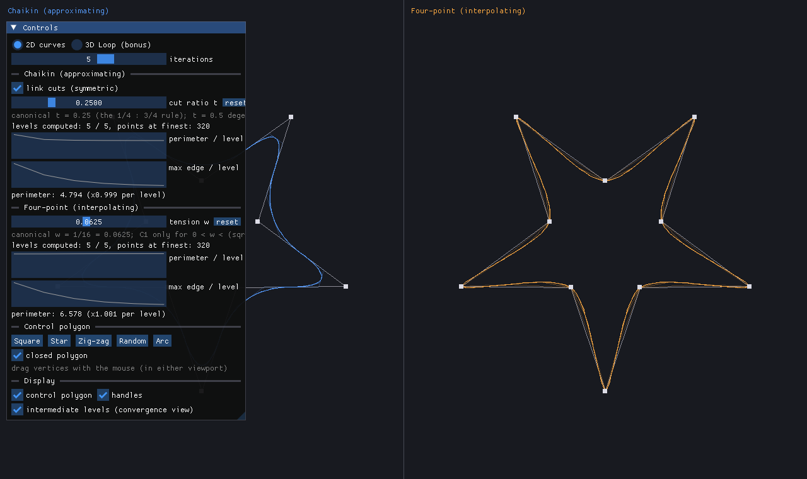
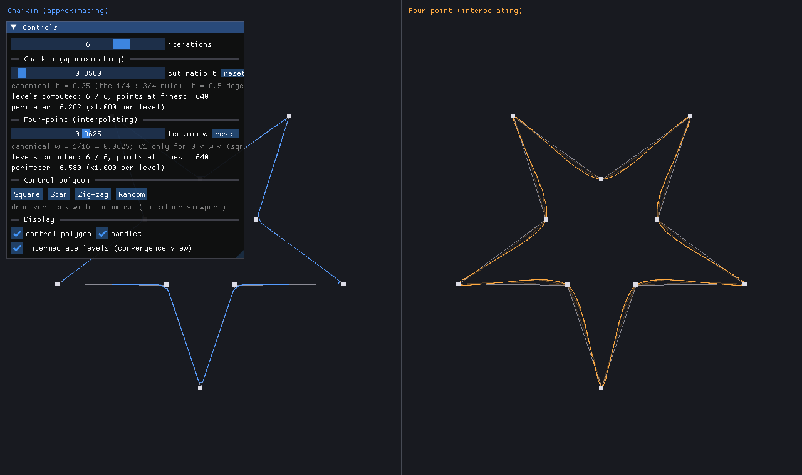
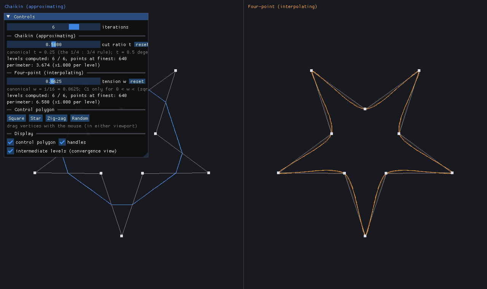
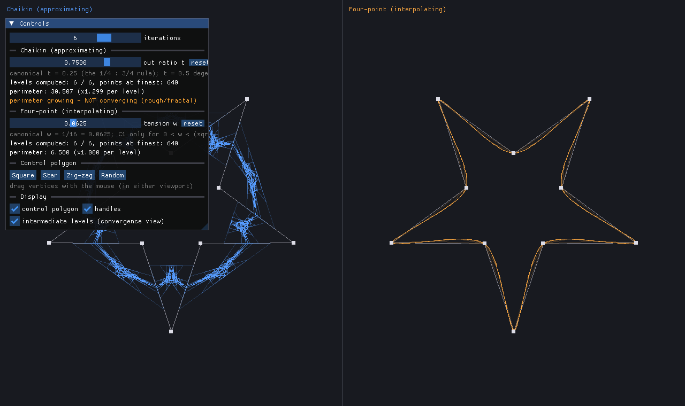
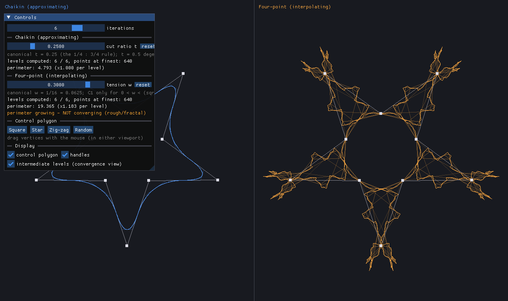
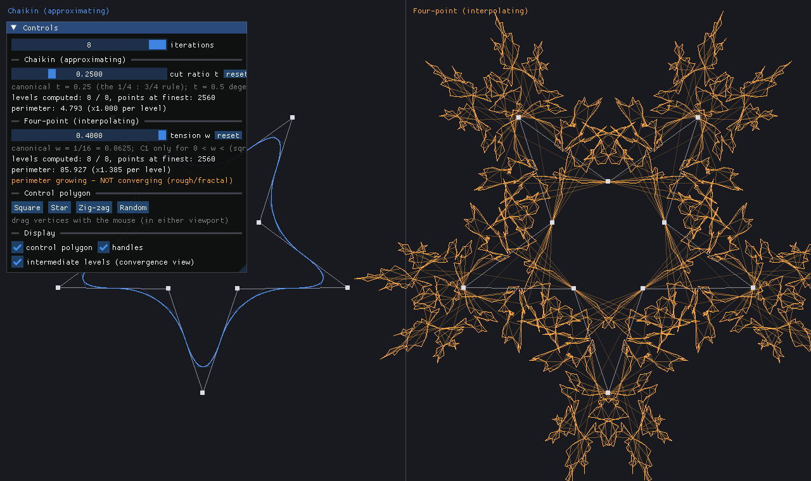
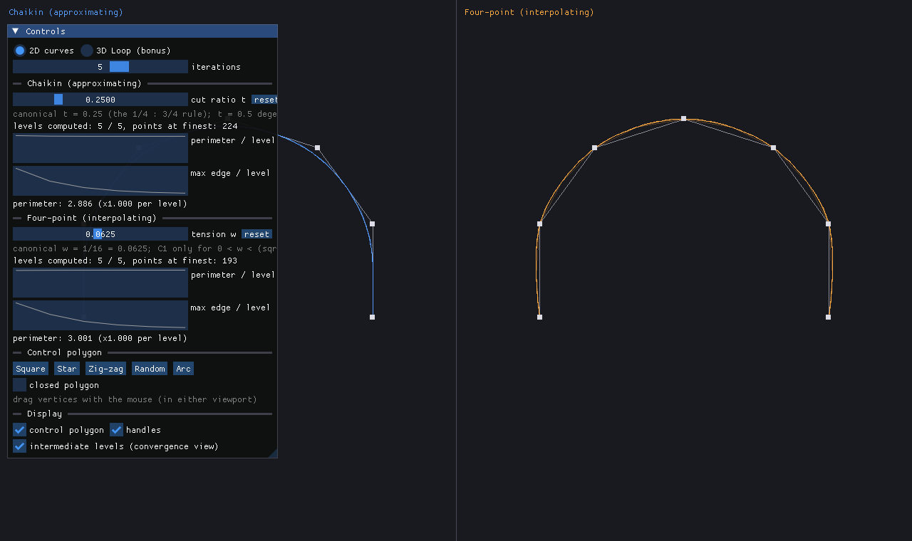
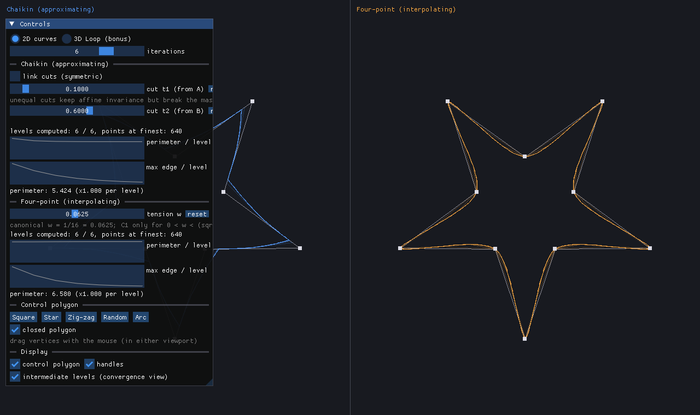
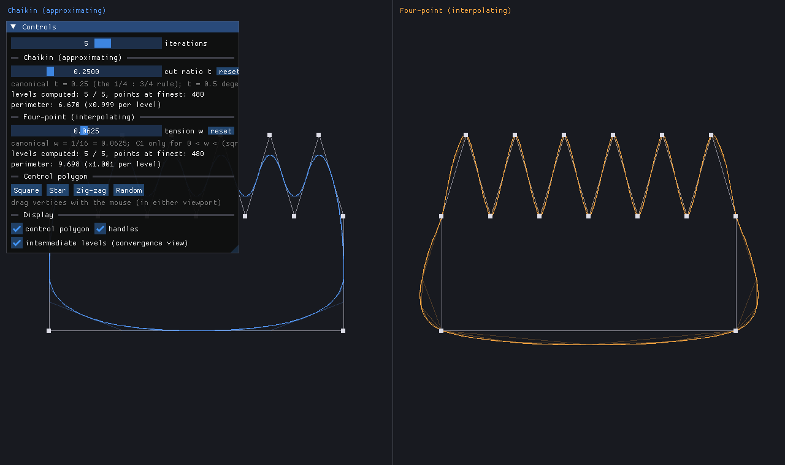
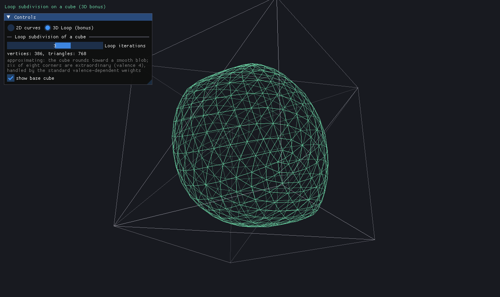

# Course Report — Interactive 2D Subdivision Visualizer

Computer Graphics mini-project (solo) · Omar El-Sheikh
Repository: <https://github.com/Omarsh03/mini-project-subdivision>

---

## 1. Goal

Build an interactive C++ application that makes the behavior of curve
subdivision schemes *tangible*: the user edits a control polygon and watches,
live, how an **approximating** scheme (Chaikin corner cutting) and an
**interpolating** scheme (four-point) refine it toward a limit curve — and,
crucially, what happens when the subdivision weights are pushed away from
their canonical values. The central experiment of the project is locating the
boundary between "converges to a smooth curve" and "turns rough, fractal, or
divergent", and understanding *why* it lies where it does.


*Star preset at canonical weights, 5 iterations. Left: Chaikin approximates —
the curve pulls inside the control polygon. Right: four-point interpolates —
the curve passes through every control point.*

## 2. What was implemented

All MUST-HAVE features from [PRD.md](../PRD.md):

- **Chaikin corner cutting** with a free cut-ratio parameter `t`
  (canonical 1/4 : 3/4), for closed and open polygons.
- **Four-point interpolating subdivision** with a free tension parameter `w`
  (canonical 1/16), including clamped endpoint handling for open polylines.
- **Side-by-side viewports** sharing a single control polygon.
- **Weight experimentation UI**: sliders spanning `t ∈ [0.01, 0.99]` and
  `w ∈ [-0.25, 0.40]`, canonical values annotated (including the four-point
  C¹ bound), one-click resets.
- **0–8 iterations** with a ghosted *convergence view* — intermediate levels
  fade in toward the finest curve, visualizing the polygon's march toward the
  limit.
- **Interactive editing**: draggable vertices (in either viewport) and four
  shape presets (square, star, zig-zag, seeded random).
- **Convergence diagnostics**: per-scheme perimeter statistics with a
  "not converging" warning, plus a hard guard against numeric blow-up
  (section 5 explains why *two* mechanisms are needed).
- **Reproducible screenshot mode** (`--screenshot`, with parameter flags):
  every figure in this report was generated by a scripted, deterministic run.

The optional **3D bonus (S1)** was also completed after the 2D core:
Loop subdivision applied to a cube, shown as a rotating wireframe
(section 7).

A later scope decision (documented in PRD/PLAN/TODO) added three more
features, chosen for maximal reuse of the existing infrastructure:
**live convergence plots** (M9, the ratio table of section 5 as a live
instrument), **open-polyline mode** (N2), and **asymmetric Chaikin** (N3) —
sections 5 and 6.4–6.5.

## 3. Architecture and design decisions

```
include/subdiv/        pure math, header-only, no library dependencies
  vec2.hpp             Vec2 + lerp (the affine primitive all masks use)
  polygon.hpp          Polygon (points + closed flag), shape presets
  scheme.hpp           SubdivisionScheme interface, refine(), perimeter(),
                       divergence guard
  chaikin.hpp          ChaikinScheme
  fourpoint.hpp        FourPointScheme
  vec3.hpp             Vec3 (3D bonus)
  trimesh.hpp          TriMesh, cube(), loopSubdivide() (3D bonus)
src/                   application layer (SDL2 + Dear ImGui)
  main.cpp             window/context setup, main loop, screenshot mode
  app.{hpp,cpp}        AppState: parameters + cached results + dirty flag
  ui.{hpp,cpp}         ImGui control panel and statistics
  viewport.{hpp,cpp}   world↔screen mapping per viewport
  canvas.{hpp,cpp}     polyline / vertex-handle drawing
  input.{hpp,cpp}      vertex dragging with hit-testing
  mesh_view.{hpp,cpp}  rotating wireframe projection (3D bonus)
tests/                 assert-based unit tests (CTest)
```

Key decisions:

- **Math core isolated from rendering.** `include/subdiv/` never touches SDL
  or ImGui, so every algorithm is unit-testable in milliseconds, and the
  application layer stays a thin consumer. This is the separation that made
  the convergence experiments easy to script.
- **A scheme is just one step.** The `SubdivisionScheme` interface has a
  single method (`step`), while iteration, per-level retention, and
  divergence protection live once in `refine()`. Adding a new scheme means
  writing only its mask.
- **Recompute-on-change instead of caching cleverness.** Point counts double
  per level, so 8 iterations of a 10-gon is 2 560 points — a full recompute
  of both schemes takes microseconds. A `dirty` flag avoids redundant work
  per frame; anything more would be over-engineering.
- **SDL_Renderer + Dear ImGui.** The app draws only polylines and points, so
  SDL2's 2D renderer is exactly sufficient, and ImGui provides the entire
  control panel (sliders, warnings, stats) with almost no UI code. ImGui is
  vendored and pinned (v1.92.8) so the build is reproducible offline.

## 4. The algorithms

### 4.1 Chaikin corner cutting (approximating)

Each edge (A, B) of the polygon is replaced by two points that cut off its
corners:

```
Q = (1−t)·A + t·B          R = t·A + (1−t)·B
```

with canonical `t = 1/4`. Old vertices are discarded; the polygon's corners
get progressively "sanded off", and the limit curve is the **quadratic
B-spline** of the control polygon — smooth (C¹), but it does not pass through
the control points; it approximates them from inside.

### 4.2 Four-point scheme (interpolating, Dyn–Levin–Gregory)

All old points are **kept**; between each consecutive pair a new point is
inserted from the four surrounding points:

```
M = (1/2 + w)·(Pᵢ + Pᵢ₊₁) − w·(Pᵢ₋₁ + Pᵢ₊₂)
```

with canonical `w = 1/16`, which makes the rule exact for cubic polynomials.
Because old points never move, the limit curve interpolates every control
point. The known theory, which the experiments below reproduce: the limit
curve is C¹ for `0 < w < (√5−1)/8 ≈ 0.1545`; at `w = 0` the rule degenerates
to midpoint insertion (the "limit curve" is the control polygon itself); and
for larger `w` smoothness degrades into fractal roughness.

Note the structural difference visible in the masks: Chaikin's weights
(`t`, `1−t` with `t ∈ (0,1)`) are **convex** combinations, while the
four-point mask has a **negative** weight (−w). That one sign difference is
what buys interpolation — and what makes the scheme *able* to misbehave.

## 5. Detecting "no longer converging" — a design story

The original plan detected divergence with an absolute coordinate bound
(10⁶): if any point escapes, stop refining and warn. Implemented, tested —
and then measurement showed it is **essentially unreachable**: even at
`w = 0.4` (far beyond any smooth regime) the maximum coordinate after 8
iterations is about 1.5 world units; even `w = 1.0` reaches only ~124.
Divergence of subdivision schemes at moderately wrong weights is *local* —
wild oscillation between neighboring points — not a global flight to
infinity. An absolute bound catches only absurd weights, long after the
visual has become meaningless.

The measurable quantity that actually separates the regimes is the
**perimeter growth ratio per level**. A convergent scheme's polygon length
approaches the limit curve's finite arc length, so the ratio decays to 1. A
fractal regime multiplies length by a constant every level — exactly like
the Koch snowflake's 4/3. Measured on the star preset (ratio at the 8th
level):

| Chaikin `t` | ratio/level | | Four-point `w` | ratio/level |
|---|---|---|---|---|
| 0.05 | 1.000 | | 0.0625 (canonical) | 1.000 |
| 0.25 (canonical) | 1.000 | | 0.12 | 1.000 |
| 0.50 | 1.000 | | 0.1545 (C¹ bound) | 1.001 |
| 0.75 | **1.288** | | 0.18 | 1.006 |
| 0.99 | **1.969** | | 0.25 | **1.063** |
| | | | 0.30 | **1.152** |
| | | | 0.40 | **1.385** |

The separation is sharp: everything convergent settles below 1.006, every
rough/fractal setting sustains ≥ 1.05. The app therefore shows the live
perimeter ratio per scheme and warns (orange) above a threshold of 1.02.
This table also exists in the app as a **live instrument**: each scheme's
panel section plots perimeter and max edge length across all levels
(`ImGui::PlotLines` over the already-retained data). Dragging a weight
slider makes the character flip visibly — perimeter flattening toward the
limit arc length in convergent regimes versus growing geometrically in
fractal ones, while max edge length (the sup-norm indicator, which *must*
tend to 0 for convergence to a curve) keeps shrinking even in Koch-like
regimes: roughness accumulating at ever-smaller scales is precisely what
"fractal" means here. The
hard coordinate guard was kept as a second line of defense — it is the one
that protects the renderer from NaN/infinite coordinates if weights are ever
extended further.

## 6. Weight experiments

All figures: star preset, 6 iterations unless noted, generated with the
screenshot mode.

### 6.1 Chaikin: the cut ratio `t`

- **`t = 0.25` (canonical)** — smooth quadratic B-spline (hero figure above).
- **`t = 0.05`** — the cuts stay near the vertices, so corners are barely
  sanded: the limit hugs the control polygon with small rounded corners.
  Still perfectly convergent (ratio 1.000) — just a "tighter" curve.

  

- **`t = 0.50`** — the two cuts coincide at the edge midpoint. After a single
  step the shape **freezes**: every further step only inserts midpoints of
  straight segments, which changes nothing geometrically. The "limit" is the
  first midpoint polygon — still a polygon, not a smooth curve. A neat
  degenerate case: convergent, but not to anything smooth.

  

- **`t = 0.75`** — the two cut points now pass each other on the edge, so
  every edge becomes a little bow-tie. Self-intersections compound each
  level into a dense "furry" band (perimeter ×1.288 per level — the orange
  warning fires). There is no limit curve.

  

An observation worth stating: **Chaikin can never explode**, for any
`t ∈ (0,1)` — both weights stay positive and sum to 1, so every new point is
a convex combination and the polygon never leaves its own convex hull. It
can fail to converge to a *curve* (above), but it cannot blow up. The
four-point scheme, with its negative weight, has no such safety net.

### 6.2 Four-point: the tension `w`

- **`w = 1/16` (canonical)** — smooth C¹ interpolant through all ten star
  vertices (hero figure).
- **`w = 0.18`** — just past the C¹ bound (≈ 0.1545). Visually the curve is
  still recognizable but develops persistent small wobbles near the spike
  tips; perimeter ratio 1.006 — hovering at the edge of the warning
  threshold, matching the theory that C⁰ convergence survives slightly
  beyond the C¹ bound.

  

- **`w = 0.30`** — clearly fractal: each spike sprouts self-similar
  sub-spikes, strongly reminiscent of a Koch construction, and the perimeter
  grows ×1.152 per level without settling. The warning fires.

  

- **`w = 0.40`, 8 iterations** — the overshoot dominates the shape entirely:
  a wildly self-intersecting snowflake several times larger than the control
  polygon, perimeter ×1.385 per level. This is the setting that exposed the
  flaw in the original absolute-bound detector (section 5): visually and
  mathematically divergent, yet the coordinates are only ~1.5 world units.

  

- **`w < 0`** — all four mask weights turn positive, so the inserted point
  is pulled *inside* the chord toward the neighbors: the curve still
  interpolates the vertices but sags between them. Small negative tensions
  are tame (ratio 1.000 at `w = −1/16`), but roughness returns on this side
  too: ×1.032 per level at `w = −0.15`, ×1.270 at `w = −0.25`. The
  convergent window is bounded in *both* directions.

### 6.3 Open polylines: endpoint behavior

With the polygon opened (the "closed polygon" toggle, or the Arc preset),
both schemes pin the endpoints and only refine the interior — Chaikin by
re-emitting the boundary points around interior cuts, four-point by
duplicating the missing neighbors at the boundary:


*The arc preset (216° of a circle, 7 points). Both curves start and end
exactly at the polyline's endpoints; four-point additionally passes through
every interior point.*

This feature cost almost nothing: endpoint handling was implemented and
unit-tested in the math core from the start (Phases 2–3), and the `closed`
flag already flowed through refinement, perimeter measurement, and drawing —
the addition was one checkbox and one preset.

### 6.4 Asymmetric Chaikin

Unlinking the cut sliders gives the two cuts independent depths: `t₁`
measured from the edge start, `t₂` from the edge end. The mask's weights
remain convex (each new point still lies on its edge), so the polygon can
never explode and the scheme still converges — but the mask loses its
symmetry and the limit curve visibly favors one side of every corner:


*t₁ = 0.1, t₂ = 0.6: corners are cut lopsidedly, producing a skewed but
still perfectly convergent curve (perimeter ratio 1.000 in the panel). A
useful contrast to the four-point experiments: this is a deformation that
degrades* aesthetics *without ever threatening* convergence.

### 6.5 Approximating vs interpolating, side by side

With both schemes at canonical weights on the same polygon, the contrast the
project was built to demonstrate is immediate: Chaikin trades exactness for
guaranteed smoothness and stability (curve inside the hull, no explosive
regime), while four-point buys interpolation with a negative weight and pays
for it with a narrow window of good behavior. The zig-zag preset makes the
same point on sharp features:



## 7. 3D bonus: Loop subdivision on a cube

The same "a scheme is one step" idea extends directly to surfaces. A minimal
indexed triangle mesh (`TriMesh`) and one function (`loopSubdivide`) implement
Loop's scheme: each edge gets a new point `3/8·(A+B) + 1/8·(C+D)` from the two
adjacent triangles' apexes, each old vertex of valence *n* is relaxed with
Warren's weights (β = 3/16 for n = 3, else 3/(8n)), and every triangle splits
into four. The app shows the result as a rotating, depth-cued wireframe with
the base cube as a ghost:


*Cube after 3 rounds of Loop subdivision (386 vertices, 768 triangles) —
approximating in 3D exactly as Chaikin is in 2D: the surface pulls inside its
control cage and rounds toward a smooth blob.*

Per the project scope, extraordinary vertices get no special analysis — but
it is worth noting that the triangulated cube contains them unavoidably: six
of the eight corners have valence 4 (extraordinary for Loop, whose regular
valence is 6), while the two corners joined by all three face diagonals reach
valence 6. The standard valence-dependent weights handle the mix without any
special casing. Unit tests verify the refinement
combinatorics (V′ = V + E, F′ = 4F, E′ = 2E + 3F, Euler characteristic 2
preserved across rounds) and the approximating property (the surface never
leaves the original cube).

This phase also produced the project's best bug story: the edge-adjacency
map was keyed with `std::minmax(a, b)` inside a small lambda — which returns
a *pair of references* to the lambda's by-value parameters, dangling the
moment it returns. The mesh tests caught it immediately as an out-of-bounds
vertex index; the fix (constructing the pair by value) is one line, and the
lesson — prefer value-constructing keys — is recorded in a comment at the
site.

## 8. Testing

The math core is covered by assert-based unit tests run via CTest
(`tests/test_subdivision.cpp`): vector algebra and lerp (including
extrapolation), preset invariants and seeded reproducibility, level
retention in `refine()`, a **hand-computed Chaikin step** on the square
(t = 1/4 → cuts at ±0.35), point-count doubling, the degenerate t = 1/2
case, a **hand-computed four-point insertion** (w = 1/16 → bulge to
(0, −0.875)), the interpolation property across multiple levels, endpoint
preservation for open polylines, perimeter measurement, and the divergence
guard (an artificial exploding scheme must trip it and every retained level
must stay renderable). The 3D bonus adds combinatorial checks on Loop
subdivision: vertex/edge/triangle counts and the Euler characteristic across
two rounds, plus the approximating property (the surface never leaves the
control cube).

## 9. Challenges encountered

- **Divergence detection that actually detects** — the main one, described
  in section 5: the planned coordinate bound was measured to be unreachable,
  and was replaced by perimeter-growth analysis grounded in what convergence
  means for arc length.
- **Mouse-input arbitration**: clicks meant for ImGui's panel must not drag
  canvas vertices underneath it; solved with ImGui's `WantCaptureMouse`
  before forwarding events, and by hit-testing against the previous frame's
  viewport layout.
- **Environment friction**: ImGui's default font atlas is ASCII-only
  (em-dashes rendered as `?` in warnings), and ImGui writes an `imgui.ini`
  layout file into the working directory by default — disabled for
  deterministic layout and a clean repository.
- **Reproducible figures**: rather than hand-taken screenshots, a
  `--screenshot` CLI mode renders a parameterized frame off the back buffer
  and exits, so every figure in this report can be regenerated with one
  command.

## 10. Conclusion

The project delivers what it set out to demonstrate: subdivision rules a few
lines long generating smooth curves; the approximating/interpolating
dichotomy visible in a single window; and — the most instructive part — a
quantified, interactive picture of *where and how* the canonical weights
earn their values. The perimeter-ratio table in section 5 is a compact
summary of the whole experiment: weights are not conventions but the exact
prices of convergence.

The 3D bonus closes the loop, so to speak: the same one-step-rule idea that
smooths a polygon into a B-spline rounds a cube toward a smooth surface,
extraordinary vertices and all. Natural extensions (kept out of scope):
open-polyline editing in the UI, asymmetric Chaikin cuts, and shaded (rather
than wireframe) rendering of the subdivided surface.
